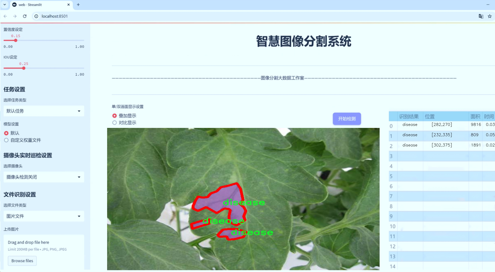
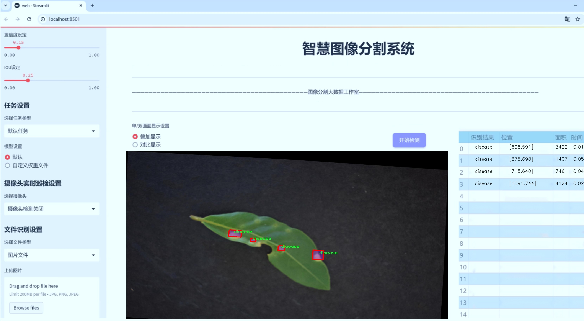
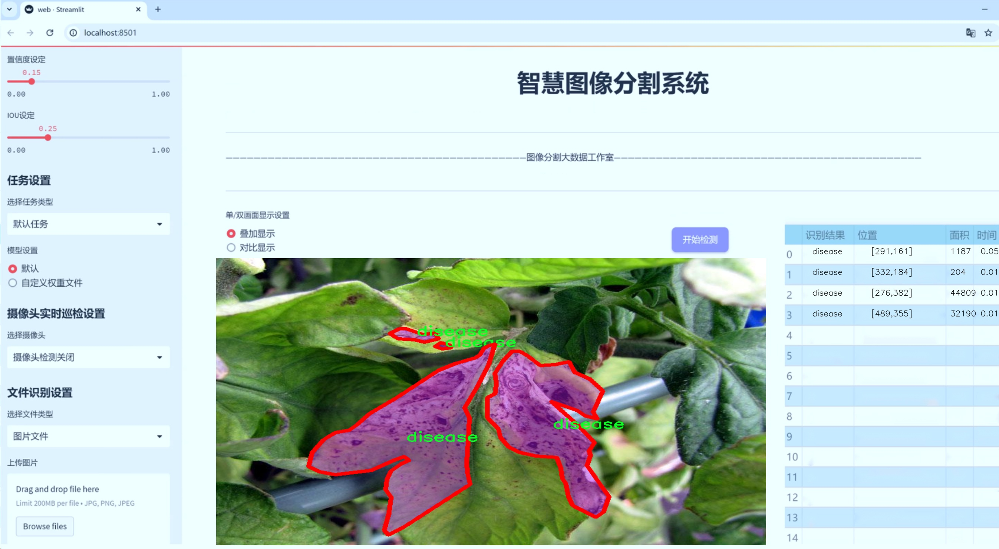
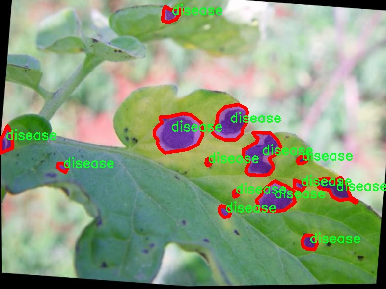
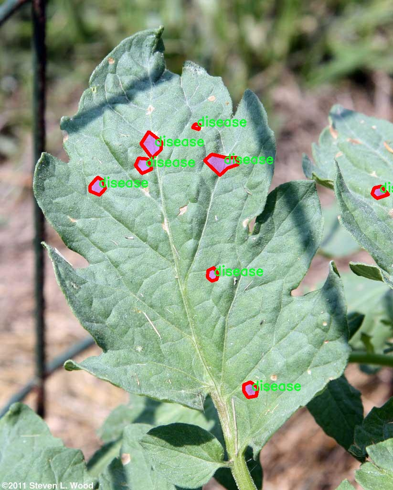
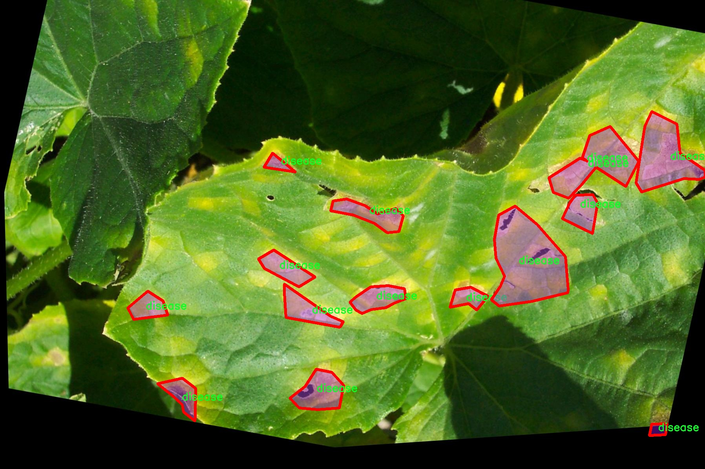
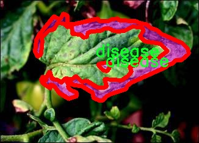
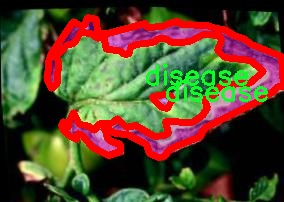

# 叶片病害分割系统： yolov8-seg-C2f-DCNV2

### 1.研究背景与意义

[参考博客](https://gitee.com/YOLOv8_YOLOv11_Segmentation_Studio/projects)

[博客来源](https://kdocs.cn/l/cszuIiCKVNis)

研究背景与意义

随着全球气候变化和农业生产方式的转变，植物病害的发生频率和范围逐渐增加，严重影响了农作物的产量和质量。叶片作为植物光合作用的主要器官，其健康状况直接关系到植物的生长和发育。因此，及时、准确地识别和分割叶片病害，对于农业生产的科学管理和病害防治具有重要意义。近年来，计算机视觉和深度学习技术的迅猛发展，为植物病害的检测和诊断提供了新的解决方案。其中，YOLO（You Only Look Once）系列模型因其高效的实时检测能力而受到广泛关注。特别是YOLOv8模型，凭借其在精度和速度上的优势，成为了植物病害检测领域的研究热点。

在此背景下，基于改进YOLOv8的叶片病害分割系统的研究应运而生。本研究利用leafCV 3.0数据集，该数据集包含1100幅图像，涵盖了两类叶片病害，分别为“Leaf Diseases”和“disease”。通过对这些图像进行实例分割，可以有效提取出病害区域，为后续的病害分析和处理提供基础数据支持。相较于传统的图像处理方法，基于深度学习的分割技术能够自动学习图像特征，显著提高了病害识别的准确性和效率。

本研究的意义在于，首先，通过改进YOLOv8模型，提升其在叶片病害分割任务中的性能，使其能够在复杂的自然环境中保持高精度的检测能力。这不仅有助于推动计算机视觉技术在农业领域的应用，还为农民和农业管理者提供了有效的工具，以便于快速识别和处理病害，降低病害对作物的影响。其次，研究将为植物病害的智能监测系统提供理论依据和技术支持，促进农业生产的智能化和数字化转型。

此外，本研究还将为相关领域的研究者提供宝贵的数据集和模型，推动植物病害检测技术的进一步发展。通过对leafCV 3.0数据集的深入分析，可以为未来的研究提供更多的思路和方向，尤其是在多样化病害类型和复杂环境条件下的检测和分割任务。最终，本研究不仅具有理论价值，还将为实际农业生产提供切实可行的解决方案，促进可持续农业的发展。

综上所述，基于改进YOLOv8的叶片病害分割系统的研究，不仅是对现有技术的创新与提升，更是对农业生产管理模式的积极探索。通过结合先进的深度学习技术与实际农业需求，本研究将为实现精准农业、提高作物产量和质量做出重要贡献。

### 2.图片演示







注意：本项目提供完整的训练源码数据集和训练教程,由于此博客编辑较早,暂不提供权重文件（best.pt）,需要按照6.训练教程进行训练后实现上图效果。

### 3.视频演示

[3.1 视频演示](https://www.bilibili.com/video/BV1dyzhYDE1Y/)

### 4.数据集信息

##### 4.1 数据集类别数＆类别名

nc: 1
names: ['disease']


##### 4.2 数据集信息简介

数据集信息展示

在本研究中，我们采用了名为“leafCV 3.0”的数据集，以支持改进YOLOv8-seg的叶片病害分割系统的训练和评估。该数据集专注于植物叶片的病害检测，尤其是针对特定类型的植物病害进行深入分析和处理。数据集的设计初衷是为了解决农业领域中植物病害识别的挑战，提供高质量的标注数据，以帮助研究人员和开发者在计算机视觉领域取得更好的成果。

“leafCV 3.0”数据集包含了丰富的图像数据，专门针对叶片病害的特征进行采集和标注。该数据集的类别数量为1，主要关注于“disease”这一类别。这一单一类别的设置使得研究者能够专注于病害的识别与分割，从而在模型训练过程中提高准确性和效率。通过对叶片病害的深入分析，研究者能够更好地理解不同病害的特征表现，为后续的图像处理和模型优化提供了坚实的基础。

数据集中包含的图像数据经过精心挑选，涵盖了多种不同类型的叶片病害，确保了数据的多样性和代表性。这些图像不仅展示了病害的不同阶段，还包括了不同环境条件下的叶片状态，使得模型在训练过程中能够学习到更为丰富的特征信息。通过对这些图像的分析，YOLOv8-seg模型能够有效地提取出病害的边界和特征，进而实现高效的分割和识别。

此外，数据集中的标注信息也极为重要。每张图像都经过专业人员的精确标注，确保了数据的准确性和可靠性。这些标注信息为模型的训练提供了明确的目标，使得YOLOv8-seg能够在训练过程中不断优化其参数，提升对叶片病害的识别能力。通过使用“leafCV 3.0”数据集，我们能够有效地评估模型在不同条件下的表现，从而不断调整和改进模型架构，最终实现更高的分割精度。

在实际应用中，改进后的YOLOv8-seg系统将能够快速、准确地识别和分割叶片病害，为农业生产提供重要的决策支持。这一系统的成功实现，不仅能够提高农作物的产量和质量，还能够降低农药的使用量，推动可持续农业的发展。因此，“leafCV 3.0”数据集在本研究中的重要性不言而喻，它为我们提供了一个坚实的基础，使得我们能够在植物病害检测领域取得突破性进展。

综上所述，“leafCV 3.0”数据集不仅在数量和质量上满足了研究需求，更为我们提供了一个深入探索叶片病害分割的良好平台。通过对该数据集的充分利用，我们期待在未来的研究中，能够进一步提升YOLOv8-seg模型的性能，为植物病害的自动检测和分割提供更加有效的解决方案。











### 5.项目依赖环境部署教程（零基础手把手教学）

[5.1 环境部署教程链接（零基础手把手教学）](https://www.bilibili.com/video/BV1jG4Ve4E9t/?vd_source=bc9aec86d164b67a7004b996143742dc)


[5.2 安装Python虚拟环境创建和依赖库安装视频教程链接（零基础手把手教学）](https://www.bilibili.com/video/BV1nA4VeYEze/?vd_source=bc9aec86d164b67a7004b996143742dc)

### 6.手把手YOLOV8-seg训练视频教程（零基础手把手教学）

[6.1 手把手YOLOV8-seg训练视频教程（零基础小白有手就能学会）](https://www.bilibili.com/video/BV1cA4VeYETe/?vd_source=bc9aec86d164b67a7004b996143742dc)


按照上面的训练视频教程链接加载项目提供的数据集，运行train.py即可开始训练



     Epoch   gpu_mem       box       obj       cls    labels  img_size
     1/200     0G   0.01576   0.01955  0.007536        22      1280: 100%|██████████| 849/849 [14:42<00:00,  1.04s/it]
               Class     Images     Labels          P          R     mAP@.5 mAP@.5:.95: 100%|██████████| 213/213 [01:14<00:00,  2.87it/s]
                 all       3395      17314      0.994      0.957      0.0957      0.0843

     Epoch   gpu_mem       box       obj       cls    labels  img_size
     2/200     0G   0.01578   0.01923  0.007006        22      1280: 100%|██████████| 849/849 [14:44<00:00,  1.04s/it]
               Class     Images     Labels          P          R     mAP@.5 mAP@.5:.95: 100%|██████████| 213/213 [01:12<00:00,  2.95it/s]
                 all       3395      17314      0.996      0.956      0.0957      0.0845

     Epoch   gpu_mem       box       obj       cls    labels  img_size
     3/200     0G   0.01561    0.0191  0.006895        27      1280: 100%|██████████| 849/849 [10:56<00:00,  1.29it/s]
               Class     Images     Labels          P          R     mAP@.5 mAP@.5:.95: 100%|███████   | 187/213 [00:52<00:00,  4.04it/s]
                 all       3395      17314      0.996      0.957      0.0957      0.0845


### 7.50+种全套YOLOV8-seg创新点加载调参实验视频教程（一键加载写好的改进模型的配置文件）

[7.1 50+种全套YOLOV8-seg创新点加载调参实验视频教程（一键加载写好的改进模型的配置文件）](https://www.bilibili.com/video/BV1Hw4VePEXv/?vd_source=bc9aec86d164b67a7004b996143742dc)

### YOLOV8-seg算法简介

原始YOLOv8-seg算法原理

YOLOv8-seg作为2023年1月由Ultralytics发布的最新目标检测模型，标志着YOLO系列的又一次重大进化。它不仅在目标检测方面取得了显著的性能提升，还在实例分割任务中展现出强大的能力。YOLOv8-seg结合了前几代YOLO模型的设计理念，尤其是YOLOv5、YOLOv6、YOLOv7和PP-YOLOE等模型的优点，形成了一种全新的算法架构。其核心在于通过引入无锚框（Anchor-Free）检测机制、改进的特征提取网络以及优化的损失函数，达到了实时检测的高精度和高速度，推动了目标检测领域的进一步发展。

YOLOv8-seg的架构主要由三个部分组成：Backbone、Neck和Head。Backbone部分负责特征提取，采用了CSPDarknet（Cross Stage Partial Darknet）结构。这一结构通过将网络分为两个部分并引入多个残差块，显著提高了特征提取的效率和效果。相较于前代模型，YOLOv8-seg使用了C2f模块替代了C3模块。C2f模块通过将输入特征图分为两个分支，分别经过卷积层进行降维，增强了特征图的表达能力。更重要的是，C2f模块还引入了v8_C2fBottleneck层，使得特征图的输出能够作为额外的分支进行堆叠，从而形成更高维度的特征图。这种设计使得模型能够更好地捕捉到图像中的细节信息，尤其是在复杂场景下的目标检测和分割任务中。

在特征提取之后，YOLOv8-seg通过快速空间金字塔池化（SPPF）结构，进一步提取不同尺度的特征。这一特征金字塔网络（FPN）与路径聚合网络（PAN）相结合的结构，能够有效地处理和压缩特征图，使得模型在保持高效性的同时，能够应对多种目标尺度的检测需求。通过多个卷积层和全连接层的组合，YOLOv8-seg将提取到的特征图转换为目标检测结果，实现了对目标的准确定位和分类。

YOLOv8-seg的另一大创新在于其无锚框检测方式。传统的目标检测模型通常依赖于预定义的锚框来进行目标的定位和分类，而YOLOv8-seg则直接预测目标的中心点及其宽高比例。这种方式不仅减少了锚框的数量，还提高了检测的速度和准确度，使得模型在处理实时视频流时表现得更加高效。此外，YOLOv8-seg还优化了损失函数，进一步提升了模型在复杂场景下的鲁棒性和精度。

在实例分割任务中，YOLOv8-seg展现了其强大的视觉识别能力。通过在目标检测的基础上，增加了对像素级别的分割能力，YOLOv8-seg能够实现对目标的精确分割。这一特性在农业、自动驾驶、安防监控等领域具有广泛的应用前景。例如，在苹果采摘的应用场景中，YOLOv8-seg能够自动检测和定位苹果，为自动采摘机器人提供精准的目标信息，从而提高采摘效率和准确性。

YOLOv8-seg的设计不仅关注于模型的性能提升，还考虑到了其在实际应用中的易用性和灵活性。模型的结构经过精心设计，使得其能够在各种硬件平台上高效运行，从CPU到GPU均可适配，确保了在不同环境下的应用效果。同时，YOLOv8-seg的开源特性也为研究人员和开发者提供了良好的平台，促进了目标检测和实例分割技术的进一步发展。

综上所述，YOLOv8-seg算法通过引入无锚框检测机制、优化的特征提取网络和创新的损失函数，成功地提升了目标检测和实例分割的性能。其高效的结构设计和强大的视觉识别能力，使得YOLOv8-seg在实时检测领域达到了新的高度，为各类应用场景提供了更为精准和高效的解决方案。随着YOLOv8-seg的不断发展和应用，目标检测技术必将迎来新的突破，推动相关领域的进步与创新。


### 9.系统功能展示（检测对象为举例，实际内容以本项目数据集为准）

图9.1.系统支持检测结果表格显示

  图9.2.系统支持置信度和IOU阈值手动调节

  图9.3.系统支持自定义加载权重文件best.pt(需要你通过步骤5中训练获得)

  图9.4.系统支持摄像头实时识别

  图9.5.系统支持图片识别

  图9.6.系统支持视频识别

  图9.7.系统支持识别结果文件自动保存

  图9.8.系统支持Excel导出检测结果数据


### 10.50+种全套YOLOV8-seg创新点原理讲解（非科班也可以轻松写刊发刊，V11版本正在科研待更新）

#### 10.1 由于篇幅限制，每个创新点的具体原理讲解就不一一展开，具体见下列网址中的创新点对应子项目的技术原理博客网址【Blog】：


[10.1 50+种全套YOLOV8-seg创新点原理讲解链接](https://gitee.com/qunmasj/good)

#### 10.2 部分改进模块原理讲解(完整的改进原理见上图和技术博客链接)【如果此小节的图加载失败可以通过CSDN或者Github搜索该博客的标题访问原始博客，原始博客图片显示正常】
### 深度学习基础
卷积神经网络通过使用具有共享参数的卷积运算显著降低了模型的计算开销和复杂性。在LeNet、AlexNet和VGG等经典网络的驱动下，卷积神经网络现在已经建立了一个完整的系统，并在深度学习领域形成了先进的卷积神经网络模型。

感受野注意力卷积RFCBAMConv的作者在仔细研究了卷积运算之后获得了灵感。对于分类、目标检测和语义分割任务，一方面，图像中不同位置的对象的形状、大小、颜色和分布是可变的。在卷积操作期间，卷积核在每个感受野中使用相同的参数来提取信息，而不考虑来自不同位置的差分信息。这限制了网络的性能，这已经在最近的许多工作中得到了证实。

另一方面，卷积运算没有考虑每个特征的重要性，这进一步影响了提取特征的有效性，并最终限制了模型的性能。此外，注意力机制允许模型专注于重要特征，这可以增强特征提取的优势和卷积神经网络捕获详细特征信息的能力。因此，注意力机制在深度学习中得到了广泛的应用，并成功地应用于各个领域。

通过研究卷积运算的内在缺陷和注意力机制的特点，作者认为现有的空间注意力机制从本质上解决了卷积运算的参数共享问题，但仍局限于对空间特征的认知。对于较大的卷积核，现有的空间注意力机制并没有完全解决共享参数的问题。此外，他们无法强调感受野中每个特征的重要性，例如现有的卷积块注意力模块（CBAM）和 Coordinate注意力（CA）。

因此，[参考该博客提出了一种新的感受野注意力机制（RFA）](https://qunmasj.com)，它完全解决了卷积核共享参数的问题，并充分考虑了感受野中每个特征的重要性。通过RFA设计的卷积运算（RFAConv）是一种新的卷积运算，可以取代现有神经网络中的标准卷积运算。RFAConv通过添加一些参数和计算开销来提高网络性能。

大量关于Imagnet-1k、MS COCO和VOC的实验已经证明了RFAConv的有效性。作为一种由注意力构建的新型卷积运算，它超过了由CAM、CBAM和CA构建的卷积运算（CAMConv、CBAMConv、CAConv）以及标准卷积运算。

此外，为了解决现有方法提取感受野特征速度慢的问题，提出了一种轻量级操作。在构建RFAConv的过程中，再次设计了CA和CBAM的升级版本，并进行了相关实验。作者认为当前的空间注意力机制应该将注意力放在感受野空间特征上，以促进当前空间注意力机制的发展，并再次增强卷积神经网络架构的优势。


### 卷积神经网络架构
出色的神经网络架构可以提高不同任务的性能。卷积运算作为卷积神经网络的一种基本运算，推动了人工智能的发展，并为车辆检测、无人机图像、医学等先进的网络模型做出了贡献。He等人认为随着网络深度的增加，该模型将变得难以训练并产生退化现象，因此他们提出了残差连接来创新卷积神经网络架构的设计。Huang等人通过重用特征来解决网络梯度消失问题，增强了特征信息，他们再次创新了卷积神经网络架构。

通过对卷积运算的详细研究，Dai等人认为，具有固定采样位置的卷积运算在一定程度上限制了网络的性能，因此提出了Deformable Conv，通过学习偏移来改变卷积核的采样位置。在Deformable Conv的基础上，再次提出了Deformable Conv V2和Deformable Conv V3，以提高卷积网络的性能。

Zhang等人注意到，组卷积可以减少模型的参数数量和计算开销。然而，少于组内信息的交互将影响最终的网络性能。1×1的卷积可以与信息相互作用。然而，这将带来更多的参数和计算开销，因此他们提出了无参数的“通道Shuffle”操作来与组之间的信息交互。

Ma等人通过实验得出结论，对于参数较少的模型，推理速度不一定更快，对于计算量较小的模型，推理也不一定更快。经过仔细研究提出了Shufflenet V2。

YOLO将输入图像划分为网格，以预测对象的位置和类别。经过不断的研究，已经提出了8个版本的基于YOLO的目标检测器，如YOLOv5、YOLOv7、YOLOv8等。上述卷积神经网络架构已经取得了巨大的成功。然而，它们并没有解决提取特征过程中的参数共享问题。本文的工作从注意力机制开始，从一个新的角度解决卷积参数共享问题。

### 注意力机制
注意力机制被用作一种提高网络模型性能的技术，使其能够专注于关键特性。注意力机制理论已经在深度学习中建立了一个完整而成熟的体系。Hu等人提出了一种Squeeze-and-Excitation（SE）块，通过压缩特征来聚合全局通道信息，从而获得与每个通道对应的权重。Wang等人认为，当SE与信息交互时，单个通道和权重之间的对应关系是间接的，因此设计了高效通道注Efficient Channel Attention力（ECA），并用自适应kernel大小的一维卷积取代了SE中的全连接（FC）层。Woo等人提出了卷积块注意力模块（CBAM），它结合了通道注意力和空间注意力。作为一个即插即用模块，它可以嵌入卷积神经网络中，以提高网络性能。

尽管SE和CBAM已经提高了网络的性能。Hou等人仍然发现压缩特征在SE和CBAM中丢失了太多信息。因此，他们提出了轻量级Coordinate注意力（CA）来解决SE和CBAM中的问题。Fu等人计了一个空间注意力模块和通道注意力模块，用于扩展全卷积网络（FCN），分别对空间维度和通道维度的语义相关性进行建模。Zhang等人在通道上生成不同尺度的特征图，以建立更有效的通道注意力机制。

本文从一个新的角度解决了标准卷积运算的参数共享问题。这就是将注意力机制结合起来构造卷积运算。尽管目前的注意力机制已经获得了良好的性能，但它们仍然没有关注感受野的空间特征。因此，设计了具有非共享参数的RFA卷积运算，以提高网络的性能。


#### 回顾标准卷积
以标准卷积运算为基础构建卷积神经网络，通过共享参数的滑动窗口提取特征信息，解决了全连接层构建的神经网络的固有问题（即参数数量大、计算开销高）。

设表示输入特征图，其中、和分别表示特征图的通道数、高度和宽度。为了能够清楚地展示卷积核提取特征信息的过程，以为例。提取每个感受野slider的特征信息的卷积运算可以表示如下：


这里，表示在每次卷积slider操作之后获得的值，表示在每个slider内的相应位置处的像素值。表示卷积核，表示卷积核中的参数数量，表示感受野slider的总数。

可以看出，每个slider内相同位置的特征共享相同的参数。因此，标准的卷积运算无法感知不同位置带来的差异信息，这在一定程度上限制了卷积神经网络的性能。

#### 回顾空间注意力
目前，空间注意力机制使用通过学习获得的注意力图来突出每个特征的重要性。与上一节类似，以为例。突出关键特征的空间注意力机制可以简单地表达如下：


这里，表示在加权运算之后获得的值。和分别表示输入特征图和学习注意力图在不同位置的值，是输入特征图的高度和宽度的乘积，表示像素值的总数。一般来说，整个过程可以简单地表示在图1中。


#### 空间注意力与标准卷积
众所周知，将注意力机制引入卷积神经网络可以提高网络的性能。通过标准的卷积运算和对现有空间注意力机制的仔细分析。作者认为空间注意力机制本质上解决了卷积神经网络的固有缺点，即共享参数的问题。

目前，该模型最常见的卷积核大小为1×1和3×3。引入空间注意力机制后用于提取特征的卷积操作是1×1或3×3卷积操作。这个过程可以直观地显示出来。空间注意力机制被插入到1×1卷积运算的前面。通过注意力图对输入特征图进行加权运算（Re-weight“×”），最后通过1×1卷积运算提取感受野的slider特征信息。

整个过程可以简单地表示如下：


 

这里，卷积核仅表示一个参数值。如果将的值作为一个新的卷积核参数，那么有趣的是，通过1×1卷积运算提取特征时的参数共享问题得到了解决。然而，空间注意力机制的传说到此结束。当空间注意力机制被插入到3×3卷积运算的前面时。具体情况如下：


如上所述，如果取的值。作为一种新的卷积核参数，上述方程完全解决了大规模卷积核的参数共享问题。然而，最重要的一点是，卷积核在每个感受野slider中提取将共享部分特征的特征。换句话说，在每个感受野slider内都会有重叠。

经过仔细分析发现，，…，空间注意力图的权重在每个slider内共享。因此，空间注意机制不能解决大规模卷积核共享参数的问题，因为它们不注意感受野的空间特征。在这种情况下，空间注意力机制是有限的。
#### 创新空间注意力与标准卷积
RFA是为了解决空间注意力机制问题而提出的，创新了空间注意力。使用与RFA相同的思想，一系列空间注意力机制可以再次提高性能。RFA设计的卷积运算可以被视为一种轻量级的即插即用模块，以取代标准卷积，从而提高卷积神经网络的性能。因此，作者认为空间注意力机制和标准卷积在未来将有一个新的春天。

感受野的空间特征：

现在给出感受野空间特征的定义。它是专门为卷积核设计的，并根据kernel大小动态生成，如图2所示，以3×3卷积核为例。


在图2中，“空间特征”表示原始特征图，等于空间特征。“感受野空间特征”表示变换后的特征，该特征由每个感受野slider滑块组成，并且不重叠。也就是说，“感受野空间特征”中的每个3×3大小的slider表示提取原始3×3卷积特征时所有感觉野slider的特征。

#### 感受野注意力卷积(RFA):

关于感受野空间特征，该博客的作者提出了感受野注意（RFA），它不仅强调了感受野slider内各种特征的重要性，而且还关注感受野空间特性，以彻底解决卷积核参数共享的问题。感受野空间特征是根据卷积核的大小动态生成的，因此，RFA是卷积的固定组合，不能脱离卷积运算的帮助，卷积运算同时依赖RFA来提高性能。

因此，作者提出了感受野注意力卷积（RFAConv）。具有3×3大小卷积核的RFAConv的总体结构如图3所示。


目前，提取感受野特征最常用的方法速度较慢，因此经过不断探索提出了一种快速的方法，通过分组卷积来取代原来的方法。

具体来说，根据感受野大小，使用相应的组卷积大小来动态生成展开特征。尽管与原始的无参数方法（如Pytorch提供的nn.Unfld()）相比，该方法添加了一些参数，但速度要快得多。

注意：正如在上一节中提到的，当原始的3×3卷积核提取特征时，感受野空间特征中的每个3×3大小的窗口表示所有感受野滑块的特征。但在快速分组卷积提取感受野特征后，由于原始方法太慢，它们会被映射到新的特征中。

最近的一些工作已经证明信息交互可以提高网络性能。类似地，对于RFAConv，与感受野特征信息交互以学习注意力图可以提高网络性能，但与每个感受野特征交互将带来额外的计算开销。为了确保少量的计算开销和参数数量，通过探索使用AvgPool池化每个感受野特征的全局信息，然后通过1×1组卷积运算与信息交互。最后，softmax用于强调感受野特征中每个特征的重要性。通常，RFA的计算可以表示为：


表示分组卷积，表示卷积核的大小，代表规范化，表示输入特征图，是通过将注意力图与变换的感受野空间特征相乘而获得的。

与CBAM和CA不同，RFA可以为每个感受野特征生成注意力图。标准卷积受到卷积神经网络性能的限制，因为共享参数的卷积运算对位置带来的差异信息不敏感。RFA完全可以解决这个问题，具体细节如下：


由于RFA获得的特征图是“调整形状”后不重叠的感受野空间特征，因此通过池化每个感受野滑块的特征信息来学习学习的注意力图。换句话说，RFA学习的注意力图不再在每个感受野slider内共享，并且是有效的。这完全解决了现有的CA和CBAM对大尺寸kernel的注意力机制中的参数共享问题。

同时，RFA给标准卷积核带来了相当大的好处，但调整形状后，特征的高度和宽度是k倍，需要进行k×k的stride卷积运算，才能提取特征信息。RFAConv创新了标准卷积运算。

此外，空间注意力机制将得到升级，因为作者认为现有的空间注意力机制应该专注于感受野空间特征，以提高网络的性能。众所周知，基于自注意力机制的网络模型取得了巨大的成功，因为它解决了卷积参数共享的问题，并对远程信息进行了建模，但基于自注意力机理的方法给模型带来了巨大的计算开销和复杂性。作者认为通过将一些现有空间注意力机制的注意力放在感受野空间特征中，它以轻量级的方式解决了自注意力机制的问题。

答案如下：

将关注感受野空间特征的空间注意力与卷积相匹配，完全解决了卷积参数共享的问题；

当前的空间注意力机制本身具有考虑远距离信息的特点，它们通过全局平均池化或全局最大池化来获得全局信息，这在一定程度上考虑了远距离信息。


为此，作者设计了一种新的CBAM和CA，称为RFACBAM和RFACA，它专注于感受野的空间特征。与RFA类似，使用stride为k的k×k的最终卷积运算来提取特征信息，具体结构如图4和图5所示，将这2种新的卷积方法称为RFCBAMConv和RFCAConv。比较原始的CBAM，使用SE注意力来代替RFCBAM中的CAM。因为这样可以减少计算开销。


此外，在RFCBAM中，通道和空间注意力不是在单独的步骤中执行的，因为通道和空间注意力是同时加权的，从而允许在每个通道上获得的注意力图是不同的。


### 11.项目核心源码讲解（再也不用担心看不懂代码逻辑）

#### 11.1 ultralytics\utils\callbacks\base.py

以下是对给定代码的核心部分进行保留和详细注释的版本。主要保留了回调函数和默认回调字典的部分。

```python
# Ultralytics YOLO 🚀, AGPL-3.0 license
"""基础回调函数模块。"""

from collections import defaultdict
from copy import deepcopy

# 训练器回调函数 ----------------------------------------------------------------------------------------------------

def on_train_start(trainer):
    """当训练开始时调用的回调函数。"""
    pass  # 在这里可以添加训练开始时需要执行的逻辑

def on_train_epoch_end(trainer):
    """每个训练周期结束时调用的回调函数。"""
    pass  # 在这里可以添加每个周期结束时需要执行的逻辑

def on_train_end(trainer):
    """当训练结束时调用的回调函数。"""
    pass  # 在这里可以添加训练结束时需要执行的逻辑

# 验证器回调函数 --------------------------------------------------------------------------------------------------

def on_val_start(validator):
    """当验证开始时调用的回调函数。"""
    pass  # 在这里可以添加验证开始时需要执行的逻辑

def on_val_end(validator):
    """当验证结束时调用的回调函数。"""
    pass  # 在这里可以添加验证结束时需要执行的逻辑

# 预测器回调函数 --------------------------------------------------------------------------------------------------

def on_predict_start(predictor):
    """当预测开始时调用的回调函数。"""
    pass  # 在这里可以添加预测开始时需要执行的逻辑

def on_predict_end(predictor):
    """当预测结束时调用的回调函数。"""
    pass  # 在这里可以添加预测结束时需要执行的逻辑

# 导出器回调函数 ---------------------------------------------------------------------------------------------------

def on_export_start(exporter):
    """当模型导出开始时调用的回调函数。"""
    pass  # 在这里可以添加导出开始时需要执行的逻辑

def on_export_end(exporter):
    """当模型导出结束时调用的回调函数。"""
    pass  # 在这里可以添加导出结束时需要执行的逻辑

# 默认回调字典，包含所有回调函数的映射关系
default_callbacks = {
    # 训练器相关的回调
    'on_train_start': [on_train_start],
    'on_train_epoch_end': [on_train_epoch_end],
    'on_train_end': [on_train_end],

    # 验证器相关的回调
    'on_val_start': [on_val_start],
    'on_val_end': [on_val_end],

    # 预测器相关的回调
    'on_predict_start': [on_predict_start],
    'on_predict_end': [on_predict_end],

    # 导出器相关的回调
    'on_export_start': [on_export_start],
    'on_export_end': [on_export_end]
}

def get_default_callbacks():
    """
    返回一个包含默认回调的字典，字典的值为默认空列表。

    返回:
        (defaultdict): 一个默认字典，包含default_callbacks中的键和空列表作为默认值。
    """
    return defaultdict(list, deepcopy(default_callbacks))

def add_integration_callbacks(instance):
    """
    将来自不同来源的集成回调添加到实例的回调中。

    参数:
        instance (Trainer, Predictor, Validator, Exporter): 一个具有'callbacks'属性的对象，该属性是一个回调列表的字典。
    """
    # 加载HUB回调
    from .hub import callbacks as hub_cb
    callbacks_list = [hub_cb]

    # 加载训练回调
    if 'Trainer' in instance.__class__.__name__:
        from .clearml import callbacks as clear_cb
        from .comet import callbacks as comet_cb
        from .dvc import callbacks as dvc_cb
        from .mlflow import callbacks as mlflow_cb
        from .neptune import callbacks as neptune_cb
        from .raytune import callbacks as tune_cb
        from .tensorboard import callbacks as tb_cb
        from .wb import callbacks as wb_cb
        callbacks_list.extend([clear_cb, comet_cb, dvc_cb, mlflow_cb, neptune_cb, tune_cb, tb_cb, wb_cb])

    # 将回调添加到回调字典中
    for callbacks in callbacks_list:
        for k, v in callbacks.items():
            if v not in instance.callbacks[k]:
                instance.callbacks[k].append(v)
```

### 代码分析
1. **回调函数**：代码中定义了一系列回调函数，这些函数在训练、验证、预测和导出过程中被调用。每个函数的实现目前都是空的，可以根据需要添加具体的逻辑。
   
2. **默认回调字典**：`default_callbacks` 字典定义了不同阶段的回调函数映射，便于在训练、验证、预测和导出时调用相应的回调。

3. **获取默认回调**：`get_default_callbacks` 函数返回一个默认回调字典的深拷贝，确保每次调用时返回的字典都是独立的。

4. **添加集成回调**：`add_integration_callbacks` 函数用于将来自不同来源的回调集成到给定实例的回调字典中，以便扩展功能。

这个文件是Ultralytics YOLO项目中的一个回调函数基类实现，主要用于在训练、验证、预测和导出模型的不同阶段执行特定的操作。文件中定义了一系列的回调函数，这些函数在特定事件发生时被调用，比如训练开始、训练结束、模型保存等。每个回调函数的实现目前都是空的，意味着在实际使用中可以根据需要进行扩展和实现具体的逻辑。

首先，文件中定义了一些与训练过程相关的回调函数。例如，`on_train_start`在训练开始时被调用，`on_train_epoch_start`在每个训练周期开始时被调用，`on_train_batch_start`在每个训练批次开始时被调用，等等。这些回调函数为用户提供了在训练的不同阶段插入自定义代码的机会，比如记录日志、调整学习率、保存模型状态等。

接下来，文件中还定义了一些与验证过程相关的回调函数，如`on_val_start`、`on_val_batch_start`和`on_val_end`等。这些函数在验证阶段被调用，允许用户在验证过程中执行特定的操作。

此外，还有一些与预测过程相关的回调函数，比如`on_predict_start`、`on_predict_batch_start`和`on_predict_end`等，这些函数在模型进行预测时被调用。

文件的最后部分定义了一个`default_callbacks`字典，其中将所有的回调函数按类别组织起来，便于管理和调用。通过`get_default_callbacks`函数，可以获取一个默认的回调字典，返回一个带有空列表的`defaultdict`，方便后续添加自定义的回调。

另外，`add_integration_callbacks`函数用于将来自不同来源的集成回调添加到给定实例的回调字典中。这个函数会根据实例的类型（如Trainer、Predictor等）加载相应的回调，并将它们添加到实例的回调列表中，以便在训练、验证或预测过程中使用。

总的来说，这个文件为Ultralytics YOLO项目提供了一个灵活的回调机制，使得用户可以在模型训练和评估的各个阶段插入自定义逻辑，从而增强模型的训练和评估过程。

#### 11.2 ultralytics\nn\extra_modules\rep_block.py

以下是代码中最核心的部分，并附上详细的中文注释：

```python
import torch
import torch.nn as nn
import torch.nn.functional as F

# 定义一个用于处理多分支卷积块的类
class DiverseBranchBlock(nn.Module):
    def __init__(self, in_channels, out_channels, kernel_size,
                 stride=1, padding=None, dilation=1, groups=1,
                 internal_channels_1x1_3x3=None,
                 deploy=False, single_init=False):
        super(DiverseBranchBlock, self).__init__()
        self.deploy = deploy  # 是否部署模式
        self.nonlinear = Conv.default_act  # 非线性激活函数
        self.kernel_size = kernel_size  # 卷积核大小
        self.out_channels = out_channels  # 输出通道数
        self.groups = groups  # 分组卷积的组数
        
        # 计算填充
        if padding is None:
            padding = autopad(kernel_size, padding, dilation)
        assert padding == kernel_size // 2  # 确保填充正确

        # 如果是部署模式，使用重参数化卷积
        if deploy:
            self.dbb_reparam = nn.Conv2d(in_channels=in_channels, out_channels=out_channels, kernel_size=kernel_size, stride=stride,
                                      padding=padding, dilation=dilation, groups=groups, bias=True)
        else:
            # 否则，构建原始卷积块
            self.dbb_origin = conv_bn(in_channels=in_channels, out_channels=out_channels, kernel_size=kernel_size, stride=stride, padding=padding, dilation=dilation, groups=groups)

            # 构建平均池化分支
            self.dbb_avg = nn.Sequential()
            if groups < out_channels:
                self.dbb_avg.add_module('conv',
                                        nn.Conv2d(in_channels=in_channels, out_channels=out_channels, kernel_size=1,
                                                  stride=1, padding=0, groups=groups, bias=False))
                self.dbb_avg.add_module('bn', BNAndPadLayer(pad_pixels=padding, num_features=out_channels))
                self.dbb_avg.add_module('avg', nn.AvgPool2d(kernel_size=kernel_size, stride=stride, padding=0))
                self.dbb_1x1 = conv_bn(in_channels=in_channels, out_channels=out_channels, kernel_size=1, stride=stride,
                                       padding=0, groups=groups)
            else:
                self.dbb_avg.add_module('avg', nn.AvgPool2d(kernel_size=kernel_size, stride=stride, padding=padding))

            self.dbb_avg.add_module('avgbn', nn.BatchNorm2d(out_channels))

            # 处理1x1和kxk卷积
            if internal_channels_1x1_3x3 is None:
                internal_channels_1x1_3x3 = in_channels if groups < out_channels else 2 * in_channels

            self.dbb_1x1_kxk = nn.Sequential()
            if internal_channels_1x1_3x3 == in_channels:
                self.dbb_1x1_kxk.add_module('idconv1', IdentityBasedConv1x1(channels=in_channels, groups=groups))
            else:
                self.dbb_1x1_kxk.add_module('conv1', nn.Conv2d(in_channels=in_channels, out_channels=internal_channels_1x1_3x3,
                                                            kernel_size=1, stride=1, padding=0, groups=groups, bias=False))
            self.dbb_1x1_kxk.add_module('bn1', BNAndPadLayer(pad_pixels=padding, num_features=internal_channels_1x1_3x3, affine=True))
            self.dbb_1x1_kxk.add_module('conv2', nn.Conv2d(in_channels=internal_channels_1x1_3x3, out_channels=out_channels,
                                                            kernel_size=kernel_size, stride=stride, padding=0, groups=groups, bias=False))
            self.dbb_1x1_kxk.add_module('bn2', nn.BatchNorm2d(out_channels))

    # 前向传播
    def forward(self, inputs):
        if hasattr(self, 'dbb_reparam'):
            return self.nonlinear(self.dbb_reparam(inputs))  # 使用重参数化卷积

        out = self.dbb_origin(inputs)  # 原始卷积块的输出
        if hasattr(self, 'dbb_1x1'):
            out += self.dbb_1x1(inputs)  # 添加1x1卷积的输出
        out += self.dbb_avg(inputs)  # 添加平均池化的输出
        out += self.dbb_1x1_kxk(inputs)  # 添加kxk卷积的输出
        return self.nonlinear(out)  # 返回经过非线性激活的输出

    # 切换到部署模式
    def switch_to_deploy(self):
        if hasattr(self, 'dbb_reparam'):
            return
        kernel, bias = self.get_equivalent_kernel_bias()  # 获取等效的卷积核和偏置
        self.dbb_reparam = nn.Conv2d(in_channels=self.dbb_origin.conv.in_channels, out_channels=self.dbb_origin.conv.out_channels,
                                     kernel_size=self.dbb_origin.conv.kernel_size, stride=self.dbb_origin.conv.stride,
                                     padding=self.dbb_origin.conv.padding, dilation=self.dbb_origin.conv.dilation, groups=self.dbb_origin.conv.groups, bias=True)
        self.dbb_reparam.weight.data = kernel  # 设置卷积核
        self.dbb_reparam.bias.data = bias  # 设置偏置
        for para in self.parameters():
            para.detach_()  # 分离参数
        self.__delattr__('dbb_origin')  # 删除原始卷积块
        self.__delattr__('dbb_avg')  # 删除平均池化块
        if hasattr(self, 'dbb_1x1'):
            self.__delattr__('dbb_1x1')  # 删除1x1卷积块
        self.__delattr__('dbb_1x1_kxk')  # 删除kxk卷积块
```

### 代码核心部分说明：
1. **DiverseBranchBlock类**：这是一个多分支卷积块的实现，支持多种卷积操作（如标准卷积、1x1卷积、平均池化等）。
2. **构造函数**：初始化输入和输出通道、卷积核大小、步幅、填充等参数，并根据是否在部署模式下构建相应的卷积层。
3. **forward方法**：定义了前向传播的逻辑，处理输入并返回经过多个分支处理后的输出。
4. **switch_to_deploy方法**：在部署模式下，获取等效的卷积核和偏置，并创建一个新的卷积层以提高推理效率。

这个程序文件实现了一个名为 `DiverseBranchBlock` 的神经网络模块，主要用于深度学习中的卷积操作。文件中包含了一些辅助函数和类，主要用于处理卷积、批归一化以及不同分支的组合。

首先，文件导入了必要的库，包括 `torch` 和 `torch.nn`，以及一些自定义的模块。接着，定义了一些辅助函数，这些函数主要用于卷积核和偏置的转换与组合。例如，`transI_fusebn` 函数用于将卷积层的权重和批归一化层的参数融合在一起，返回融合后的卷积核和偏置。其他的转换函数如 `transII_addbranch`、`transIII_1x1_kxk`、`transIV_depthconcat` 等，分别用于不同的卷积核和偏置的处理，支持多种卷积操作的组合。

接下来，定义了一个 `conv_bn` 函数，用于创建一个包含卷积层和批归一化层的序列模块。这个函数在构建 `DiverseBranchBlock` 时被多次调用。

`IdentityBasedConv1x1` 类继承自 `nn.Conv2d`，实现了一个特殊的1x1卷积层。它在初始化时创建了一个单位矩阵的卷积核，并在前向传播时将其与学习到的权重相加，从而实现了某种形式的恒等映射。

`BNAndPadLayer` 类实现了一个结合了批归一化和填充的层。它在前向传播时对输入进行批归一化处理，并根据需要进行填充，确保输出的尺寸与输入一致。

`DiverseBranchBlock` 类是这个文件的核心部分。它在初始化时接受多个参数，包括输入通道数、输出通道数、卷积核大小等。根据这些参数，构建了多个分支，包括原始卷积分支、1x1卷积分支、平均池化分支等。每个分支都可以独立地进行卷积和批归一化处理。

在 `DiverseBranchBlock` 中，`get_equivalent_kernel_bias` 方法用于获取等效的卷积核和偏置，便于在推理阶段进行优化。`switch_to_deploy` 方法则用于将模块切换到部署模式，减少计算开销。

`forward` 方法定义了模块的前向传播逻辑，依次计算各个分支的输出，并将它们相加，最后通过非线性激活函数进行处理。

最后，模块还提供了一些初始化方法，如 `init_gamma` 和 `single_init`，用于初始化批归一化层的权重。

总体而言，这个文件实现了一个灵活且高效的卷积模块，适用于各种深度学习任务，特别是在需要多分支结构的情况下。

#### 11.3 ultralytics\utils\autobatch.py

以下是经过简化并添加详细中文注释的核心代码部分：

```python
import numpy as np
import torch
from ultralytics.utils import LOGGER, colorstr
from ultralytics.utils.torch_utils import profile

def check_train_batch_size(model, imgsz=640, amp=True):
    """
    检查YOLO模型的训练批量大小。

    参数:
        model (torch.nn.Module): 要检查批量大小的YOLO模型。
        imgsz (int): 用于训练的图像大小。
        amp (bool): 如果为True，则使用自动混合精度（AMP）进行训练。

    返回:
        (int): 使用autobatch()函数计算的最佳批量大小。
    """
    with torch.cuda.amp.autocast(amp):
        return autobatch(model.train(), imgsz)  # 计算最佳批量大小

def autobatch(model, imgsz=640, fraction=0.60, batch_size=16):
    """
    自动估计最佳YOLO批量大小，以使用可用CUDA内存的一部分。

    参数:
        model (torch.nn.Module): 要计算批量大小的YOLO模型。
        imgsz (int): 用作YOLO模型输入的图像大小，默认为640。
        fraction (float): 要使用的可用CUDA内存的比例，默认为0.60。
        batch_size (int): 如果检测到错误，则使用的默认批量大小，默认为16。

    返回:
        (int): 最佳批量大小。
    """
    # 检查设备
    prefix = colorstr('AutoBatch: ')
    LOGGER.info(f'{prefix}计算imgsz={imgsz}的最佳批量大小')
    device = next(model.parameters()).device  # 获取模型所在设备
    if device.type == 'cpu':
        LOGGER.info(f'{prefix}未检测到CUDA，使用默认CPU批量大小 {batch_size}')
        return batch_size

    # 检查CUDA内存
    gb = 1 << 30  # 字节转GiB (1024 ** 3)
    properties = torch.cuda.get_device_properties(device)  # 获取设备属性
    total_memory = properties.total_memory / gb  # GiB总内存
    reserved_memory = torch.cuda.memory_reserved(device) / gb  # GiB保留内存
    allocated_memory = torch.cuda.memory_allocated(device) / gb  # GiB已分配内存
    free_memory = total_memory - (reserved_memory + allocated_memory)  # GiB可用内存
    LOGGER.info(f'{prefix}{device} ({properties.name}) {total_memory:.2f}G总, {reserved_memory:.2f}G保留, {allocated_memory:.2f}G已分配, {free_memory:.2f}G可用')

    # 轮询批量大小
    batch_sizes = [1, 2, 4, 8, 16]
    try:
        img = [torch.empty(b, 3, imgsz, imgsz) for b in batch_sizes]  # 创建空图像张量
        results = profile(img, model, n=3, device=device)  # 轮询性能

        # 拟合解决方案
        memory_usage = [x[2] for x in results if x]  # 获取内存使用情况
        p = np.polyfit(batch_sizes[:len(memory_usage)], memory_usage, deg=1)  # 一次多项式拟合
        optimal_batch_size = int((free_memory * fraction - p[1]) / p[0])  # 计算最佳批量大小

        # 检查是否有失败的批量大小
        if None in results:
            fail_index = results.index(None)  # 获取第一个失败的索引
            if optimal_batch_size >= batch_sizes[fail_index]:  # 如果最佳批量大小超过失败点
                optimal_batch_size = batch_sizes[max(fail_index - 1, 0)]  # 选择安全点

        # 检查最佳批量大小是否在安全范围内
        if optimal_batch_size < 1 or optimal_batch_size > 1024:
            optimal_batch_size = batch_size
            LOGGER.info(f'{prefix}警告 ⚠️ 检测到CUDA异常，使用默认批量大小 {batch_size}.')

        # 记录实际使用的内存比例
        fraction_used = (np.polyval(p, optimal_batch_size) + reserved_memory + allocated_memory) / total_memory
        LOGGER.info(f'{prefix}使用批量大小 {optimal_batch_size}，{total_memory * fraction_used:.2f}G/{total_memory:.2f}G ({fraction_used * 100:.0f}%) ✅')
        return optimal_batch_size
    except Exception as e:
        LOGGER.warning(f'{prefix}警告 ⚠️ 检测到错误: {e}, 使用默认批量大小 {batch_size}.')
        return batch_size
```

### 代码注释说明：
1. **check_train_batch_size** 函数用于检查给定YOLO模型的最佳训练批量大小，支持自动混合精度（AMP）。
2. **autobatch** 函数负责自动估计最佳批量大小，考虑了可用的CUDA内存。它会检查设备类型、内存使用情况，并通过性能轮询来计算最佳批量大小。
3. 在内存检查中，记录了总内存、保留内存、已分配内存和可用内存，并输出相关信息。
4. 通过多项式拟合，计算出最佳批量大小，并确保其在安全范围内。
5. 如果在计算过程中发生错误，将返回默认的批量大小并记录警告信息。

这个程序文件`ultralytics/utils/autobatch.py`主要用于在PyTorch中估算最佳的YOLO模型训练批量大小，以便合理利用可用的CUDA内存。程序首先导入了一些必要的库和模块，包括深拷贝、NumPy和PyTorch，以及Ultralytics库中的一些工具函数和默认配置。

文件中定义了两个主要函数：`check_train_batch_size`和`autobatch`。`check_train_batch_size`函数用于检查给定YOLO模型的最佳训练批量大小。它接受模型、图像大小和是否使用自动混合精度（AMP）作为参数。在函数内部，使用`torch.cuda.amp.autocast`上下文管理器来启用AMP，然后调用`autobatch`函数来计算最佳批量大小。

`autobatch`函数是核心功能实现，它自动估算最佳的YOLO批量大小。函数参数包括模型、图像大小、使用的CUDA内存比例和默认批量大小。首先，函数检查模型所在的设备，如果是CPU，则返回默认的批量大小。如果CUDA环境不符合要求（如`torch.backends.cudnn.benchmark`为True），也会返回默认批量大小。

接下来，函数会检查CUDA内存的使用情况，包括总内存、保留内存和已分配内存，并计算出可用的自由内存。然后，程序会对一组预定义的批量大小（1, 2, 4, 8, 16）进行性能分析，生成输入图像并调用`profile`函数来获取不同批量大小下的内存使用情况。

通过对内存使用情况进行线性拟合，程序计算出最佳批量大小。如果在分析过程中某些批量大小失败，程序会选择一个安全的先前批量大小。如果计算出的批量大小不在安全范围内（小于1或大于1024），则使用默认批量大小。最后，程序会记录使用的批量大小和内存使用情况，并返回计算出的最佳批量大小。

在整个过程中，程序还通过日志记录提供了详细的信息，帮助用户了解内存使用情况和可能出现的问题。如果在执行过程中发生异常，程序会捕获异常并返回默认的批量大小，同时记录警告信息。

#### 11.4 ultralytics\nn\modules\head.py

以下是代码中最核心的部分，并附上详细的中文注释：

```python
import torch
import torch.nn as nn

class Detect(nn.Module):
    """YOLOv8 检测头，用于目标检测模型。"""
    
    def __init__(self, nc=80, ch=()):
        """初始化 YOLOv8 检测层，指定类别数和通道数。
        
        参数:
            nc (int): 类别数，默认为 80。
            ch (tuple): 输入通道数的元组。
        """
        super().__init__()
        self.nc = nc  # 类别数
        self.nl = len(ch)  # 检测层的数量
        self.reg_max = 16  # DFL 通道数
        self.no = nc + self.reg_max * 4  # 每个锚点的输出数量
        self.stride = torch.zeros(self.nl)  # 在构建过程中计算的步幅
        
        # 定义卷积层
        c2, c3 = max((16, ch[0] // 4, self.reg_max * 4)), max(ch[0], min(self.nc, 100))  # 通道数
        self.cv2 = nn.ModuleList(
            nn.Sequential(Conv(x, c2, 3), Conv(c2, c2, 3), nn.Conv2d(c2, 4 * self.reg_max, 1)) for x in ch)
        self.cv3 = nn.ModuleList(nn.Sequential(Conv(x, c3, 3), Conv(c3, c3, 3), nn.Conv2d(c3, self.nc, 1)) for x in ch)
        self.dfl = DFL(self.reg_max) if self.reg_max > 1 else nn.Identity()  # DFL 层

    def forward(self, x):
        """连接并返回预测的边界框和类别概率。
        
        参数:
            x (list): 输入特征图列表。
        
        返回:
            y (tensor): 预测的边界框和类别概率。
        """
        shape = x[0].shape  # 获取输入形状 BCHW
        for i in range(self.nl):
            # 对每个检测层进行卷积操作并连接结果
            x[i] = torch.cat((self.cv2[i](x[i]), self.cv3[i](x[i])), 1)
        
        # 如果是训练模式，直接返回特征图
        if self.training:
            return x
        
        # 动态生成锚点和步幅
        self.anchors, self.strides = (x.transpose(0, 1) for x in make_anchors(x, self.stride, 0.5))
        self.shape = shape

        # 将特征图展平并分割为边界框和类别概率
        x_cat = torch.cat([xi.view(shape[0], self.no, -1) for xi in x], 2)
        box, cls = x_cat.split((self.reg_max * 4, self.nc), 1)  # 分割为边界框和类别
        
        # 计算解码后的边界框
        dbox = dist2bbox(self.dfl(box), self.anchors.unsqueeze(0), xywh=True, dim=1) * self.strides

        # 将边界框和类别概率连接在一起
        y = torch.cat((dbox, cls.sigmoid()), 1)
        return y  # 返回最终结果

    def bias_init(self):
        """初始化 Detect() 的偏置，警告：需要步幅可用。"""
        m = self  # 当前模型
        for a, b, s in zip(m.cv2, m.cv3, m.stride):  # 遍历卷积层
            a[-1].bias.data[:] = 1.0  # 边界框偏置初始化
            b[-1].bias.data[:m.nc] = math.log(5 / m.nc / (640 / s) ** 2)  # 类别偏置初始化
```

### 代码说明：
1. **Detect 类**：这是 YOLOv8 模型的检测头，负责处理输入特征并生成预测的边界框和类别概率。
2. **初始化方法 `__init__`**：设置类别数、检测层数、卷积层等参数，并定义网络结构。
3. **前向传播方法 `forward`**：接收输入特征图，进行卷积操作，生成边界框和类别概率，返回最终的预测结果。
4. **偏置初始化方法 `bias_init`**：用于初始化模型中的偏置项，以提高模型的训练效果。

这个代码片段是 YOLOv8 模型中最核心的部分，负责实现目标检测的基本功能。

这个程序文件是Ultralytics YOLO（You Only Look Once）模型的一个重要模块，主要实现了模型的头部结构，包括检测、分割、姿态估计和分类等功能。文件中包含多个类，每个类对应不同的任务。

首先，`Detect`类是YOLOv8检测头的实现，负责处理目标检测任务。它的构造函数初始化了类别数、通道数、输出数量等参数，并构建了多个卷积层。`forward`方法接收输入数据，经过一系列卷积操作后，生成预测的边界框和类别概率。在训练模式下，返回的是中间结果，而在推理模式下，则会计算锚框并返回最终的预测结果。

接下来，`Segment`类继承自`Detect`类，专门用于图像分割任务。它增加了对掩膜和原型的处理，构造函数中初始化了掩膜数量和原型数量。在`forward`方法中，除了返回检测结果外，还会返回掩膜系数和原型。

`Pose`类同样继承自`Detect`类，专注于关键点检测任务。它在构造函数中定义了关键点的形状，并在`forward`方法中处理关键点的预测。`kpts_decode`方法用于解码关键点的坐标。

`Classify`类是YOLOv8的分类头，负责将输入的特征图转换为类别预测。它使用卷积层和线性层，结合自适应平均池化和Dropout，进行分类任务的前向传播。

最后，`RTDETRDecoder`类实现了实时可变形Transformer解码器，结合了Transformer架构和可变形卷积，用于生成边界框和分类分数。它的构造函数初始化了多个参数，包括隐藏层维度、查询数量和解码层数等。`forward`方法处理输入特征，经过解码器生成最终的预测结果。

整个文件通过定义不同的类和方法，提供了YOLOv8模型的各个功能模块，使得模型能够执行多种计算机视觉任务，如目标检测、图像分割、姿态估计和图像分类。每个类的设计都考虑到了特定任务的需求，并通过适当的网络结构和参数初始化来优化性能。

#### 11.5 ultralytics\models\nas\__init__.py

以下是代码中最核心的部分，并附上详细的中文注释：

```python
# 导入必要的模块和类
from .model import NAS  # 从当前包的model模块中导入NAS类
from .predict import NASPredictor  # 从当前包的predict模块中导入NASPredictor类
from .val import NASValidator  # 从当前包的val模块中导入NASValidator类

# 定义当前模块的公共接口，只有这些类可以被外部访问
__all__ = 'NASPredictor', 'NASValidator', 'NAS'
```

### 代码注释说明：

1. **导入模块**：
   - `from .model import NAS`：从当前包的`model`模块中导入`NAS`类，这个类可能是实现神经架构搜索（Neural Architecture Search）相关功能的核心类。
   - `from .predict import NASPredictor`：从当前包的`predict`模块中导入`NASPredictor`类，这个类可能用于对模型进行预测。
   - `from .val import NASValidator`：从当前包的`val`模块中导入`NASValidator`类，这个类可能用于验证模型的性能。

2. **定义公共接口**：
   - `__all__ = 'NASPredictor', 'NASValidator', 'NAS'`：这是一个特殊的变量，用于定义当前模块的公共接口。当使用`from module import *`语句时，只有在`__all__`中列出的类和函数会被导入。这有助于控制模块的可见性，避免不必要的名称冲突。

通过这些核心部分，代码实现了模块的结构和类的导入，为后续的模型预测和验证提供了基础。

这个程序文件是Ultralytics YOLO项目中的一个初始化文件，通常用于模块的组织和导入。在这个文件中，首先通过注释标明了项目的名称和许可证类型，表明这是一个开源项目，遵循AGPL-3.0许可证。

接下来，文件通过相对导入的方式引入了三个模块：`NAS`、`NASPredictor`和`NASValidator`。这些模块分别定义了与神经架构搜索（NAS）相关的模型、预测器和验证器。具体来说，`NAS`可能是一个用于构建和训练神经网络模型的类，`NASPredictor`是一个用于进行预测的类，而`NASValidator`则用于验证模型的性能。

最后，`__all__`变量定义了该模块公开的接口，列出了可以被外部导入的类或函数。在这里，`__all__`包含了`NASPredictor`、`NASValidator`和`NAS`，这意味着当其他模块使用`from ultralytics.models.nas import *`时，只会导入这三个对象。这种做法有助于控制模块的可见性，避免不必要的命名冲突。

### 12.系统整体结构（节选）

### 整体功能和构架概括

Ultralytics YOLO项目是一个用于目标检测和计算机视觉任务的深度学习框架。该项目采用模块化设计，便于扩展和维护。整体架构包括多个功能模块，每个模块负责特定的任务，如模型构建、训练回调、自动批量大小调整、特征提取和解码等。

- **回调机制**：通过`ultralytics/utils/callbacks/base.py`实现，允许用户在训练和验证过程中插入自定义逻辑。
- **网络模块**：`ultralytics/nn/extra_modules/rep_block.py`实现了多种卷积操作和分支结构，增强了模型的灵活性和表达能力。
- **自动批量大小调整**：`ultralytics/utils/autobatch.py`用于根据可用的CUDA内存动态调整训练批量大小，以优化训练性能。
- **模型头部**：`ultralytics/nn/modules/head.py`实现了不同任务的模型头部，包括目标检测、图像分割、姿态估计和分类，负责最终的预测输出。
- **神经架构搜索**：`ultralytics/models/nas/__init__.py`组织了与神经架构搜索相关的模块，提供了构建、预测和验证的功能。

### 文件功能整理表

| 文件路径                                          | 功能描述                                                                                     |
|--------------------------------------------------|----------------------------------------------------------------------------------------------|
| `ultralytics/utils/callbacks/base.py`           | 实现训练、验证和预测过程中的回调机制，允许用户在不同阶段插入自定义逻辑。                   |
| `ultralytics/nn/extra_modules/rep_block.py`    | 定义了多种卷积操作和分支结构，构建灵活的卷积模块，支持目标检测和其他计算机视觉任务。       |
| `ultralytics/utils/autobatch.py`                | 自动估算最佳的训练批量大小，以合理利用CUDA内存，优化训练性能。                           |
| `ultralytics/nn/modules/head.py`                | 实现YOLO模型的头部结构，支持目标检测、图像分割、姿态估计和分类等多种任务的预测输出。     |
| `ultralytics/models/nas/__init__.py`            | 组织与神经架构搜索相关的模块，提供模型构建、预测和验证的功能。                           |

通过这种模块化的设计，Ultralytics YOLO项目能够高效地处理多种计算机视觉任务，同时保持良好的可扩展性和可维护性。

### 13.图片、视频、摄像头图像分割Demo(去除WebUI)代码

在这个博客小节中，我们将讨论如何在不使用WebUI的情况下，实现图像分割模型的使用。本项目代码已经优化整合，方便用户将分割功能嵌入自己的项目中。
核心功能包括图片、视频、摄像头图像的分割，ROI区域的轮廓提取、类别分类、周长计算、面积计算、圆度计算以及颜色提取等。
这些功能提供了良好的二次开发基础。

### 核心代码解读

以下是主要代码片段，我们会为每一块代码进行详细的批注解释：

```python
import random
import cv2
import numpy as np
from PIL import ImageFont, ImageDraw, Image
from hashlib import md5
from model import Web_Detector
from chinese_name_list import Label_list

# 根据名称生成颜色
def generate_color_based_on_name(name):
    ......

# 计算多边形面积
def calculate_polygon_area(points):
    return cv2.contourArea(points.astype(np.float32))

...
# 绘制中文标签
def draw_with_chinese(image, text, position, font_size=20, color=(255, 0, 0)):
    image_pil = Image.fromarray(cv2.cvtColor(image, cv2.COLOR_BGR2RGB))
    draw = ImageDraw.Draw(image_pil)
    font = ImageFont.truetype("simsun.ttc", font_size, encoding="unic")
    draw.text(position, text, font=font, fill=color)
    return cv2.cvtColor(np.array(image_pil), cv2.COLOR_RGB2BGR)

# 动态调整参数
def adjust_parameter(image_size, base_size=1000):
    max_size = max(image_size)
    return max_size / base_size

# 绘制检测结果
def draw_detections(image, info, alpha=0.2):
    name, bbox, conf, cls_id, mask = info['class_name'], info['bbox'], info['score'], info['class_id'], info['mask']
    adjust_param = adjust_parameter(image.shape[:2])
    spacing = int(20 * adjust_param)

    if mask is None:
        x1, y1, x2, y2 = bbox
        aim_frame_area = (x2 - x1) * (y2 - y1)
        cv2.rectangle(image, (x1, y1), (x2, y2), color=(0, 0, 255), thickness=int(3 * adjust_param))
        image = draw_with_chinese(image, name, (x1, y1 - int(30 * adjust_param)), font_size=int(35 * adjust_param))
        y_offset = int(50 * adjust_param)  # 类别名称上方绘制，其下方留出空间
    else:
        mask_points = np.concatenate(mask)
        aim_frame_area = calculate_polygon_area(mask_points)
        mask_color = generate_color_based_on_name(name)
        try:
            overlay = image.copy()
            cv2.fillPoly(overlay, [mask_points.astype(np.int32)], mask_color)
            image = cv2.addWeighted(overlay, 0.3, image, 0.7, 0)
            cv2.drawContours(image, [mask_points.astype(np.int32)], -1, (0, 0, 255), thickness=int(8 * adjust_param))

            # 计算面积、周长、圆度
            area = cv2.contourArea(mask_points.astype(np.int32))
            perimeter = cv2.arcLength(mask_points.astype(np.int32), True)
            ......

            # 计算色彩
            mask = np.zeros(image.shape[:2], dtype=np.uint8)
            cv2.drawContours(mask, [mask_points.astype(np.int32)], -1, 255, -1)
            color_points = cv2.findNonZero(mask)
            ......

            # 绘制类别名称
            x, y = np.min(mask_points, axis=0).astype(int)
            image = draw_with_chinese(image, name, (x, y - int(30 * adjust_param)), font_size=int(35 * adjust_param))
            y_offset = int(50 * adjust_param)

            # 绘制面积、周长、圆度和色彩值
            metrics = [("Area", area), ("Perimeter", perimeter), ("Circularity", circularity), ("Color", color_str)]
            for idx, (metric_name, metric_value) in enumerate(metrics):
                ......

    return image, aim_frame_area

# 处理每帧图像
def process_frame(model, image):
    pre_img = model.preprocess(image)
    pred = model.predict(pre_img)
    det = pred[0] if det is not None and len(det)
    if det:
        det_info = model.postprocess(pred)
        for info in det_info:
            image, _ = draw_detections(image, info)
    return image

if __name__ == "__main__":
    cls_name = Label_list
    model = Web_Detector()
    model.load_model("./weights/yolov8s-seg.pt")

    # 摄像头实时处理
    cap = cv2.VideoCapture(0)
    while cap.isOpened():
        ret, frame = cap.read()
        if not ret:
            break
        ......

    # 图片处理
    image_path = './icon/OIP.jpg'
    image = cv2.imread(image_path)
    if image is not None:
        processed_image = process_frame(model, image)
        ......

    # 视频处理
    video_path = ''  # 输入视频的路径
    cap = cv2.VideoCapture(video_path)
    while cap.isOpened():
        ret, frame = cap.read()
        ......
```


### 14.完整训练+Web前端界面+50+种创新点源码、数据集获取


# [下载链接：https://mbd.pub/o/bread/Z5uUmZls](https://mbd.pub/o/bread/Z5uUmZls)